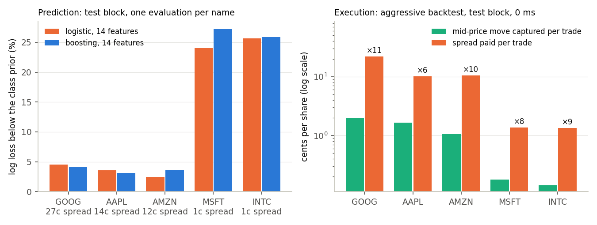

# lob-prediction-execution

Personal project, done on the side of my MSc in financial engineering at EPFL.
The question I wanted to answer: if you can predict where the mid-price of a
stock is going over the next few dozen order book events (and you can, a
bit), can you actually make money from it once you pay the spread?

Short answer for the data I had: no. The signal is real, around 2 cents of
mid-price move on a stock with a 13 cent spread, and crossing the spread
costs 5 to 10 times that. Limit orders don't fix it either, because they
mostly get filled when the price is about to go against you. The rest of
this README is the long answer.

Data: the free LOBSTER samples (Nasdaq, 21 June 2012, 10 levels). Most of
the work is on AAPL (400k events); the four other names are used at the end
as a check.

## Setup

The label is the sign of the mid-price change 50 events later, three classes
(down / flat / up). I compare integer prices from the LOBSTER files directly
so there are no rounding issues with the flat class.

The day is split chronologically 60/20/20 into train / validation / test.
The last 50 events of each block are dropped so that no label in one block
uses prices from the next one. Features are causal, scalers and models are
fit on train only.

I used the test block exactly once, after fixing everything on validation.
Everything I did afterwards (MLP, bootstrap, new features, passive
execution) is evaluated on validation only. I say it explicitly where a
number comes from test.

For AAPL that gives 240k train / 80k validation / 80k test rows. 50 events is
about 2.6 s at the median but anywhere between 0.03 s and 15 s depending on
activity.

## Features and models

14 features to start with: spread, imbalance at levels 1, 5 and 10, the
quantity-weighted mid offset, log returns and realised vol over 10/50/100
events, and order flow imbalance (Cont, Kukanov, Stoikov 2014) summed over
the same windows.

Models: class-prior baseline, logistic regression (with 1, 11 or 14
features), histogram gradient boosting, and a small MLP (32, 16) trained one
epoch at a time with the best validation epoch kept, over 5 seeds.

## Results on AAPL

| Model | Val log loss | Test log loss | Val accuracy |
|---|---:|---:|---:|
| Prior | 0.910 | 0.927 | 48.1% |
| Logistic, imbalance only | 0.908 | | 51.1% |
| Logistic, 11 features | 0.900 | | 52.6% |
| Logistic, 14 features | 0.889 | 0.894 | 55.3% |
| Boosting, 14 features | 0.882 | 0.898 | 55.6% |
| MLP, 14 features (5 seeds) | 0.881 ± 0.002 | not evaluated | 55.9% |


A few things I take from this. OFI is the feature that matters: adding the
three OFI windows to the logistic model gains more than the ten other
features combined. Boosting and the MLP are indistinguishable (the
difference is smaller than the seed-to-seed std of the MLP), and the MLP
stops improving after 2 to 4 epochs, so I didn't push further on model
size. On test the logistic model actually beats boosting; I think that's
mild overfitting to the morning regime, but one ordering on one day doesn't
prove much.


Note that the flat class is only 8% of events on AAPL (the stock is at $580,
the mid moves almost every 50 events) and none of the models ever predict
it, so accuracy is basically an up-vs-down number.

### Adding features from the message file

The 14 features above only use the book snapshots. LOBSTER also gives you
the messages (submissions, cancellations, executions with direction), so I
added four families and a control column, and ran ablations: each family
added to the 14, each family removed from the full set, plus permutation
importance. Same rows for every feature set.

| Family | What's in it |
|---|---|
| trades | signed and total executed volume over 10/50/100 events (a trade hitting a sell order counts positive) |
| flow | signed submissions minus signed cancellations, and cancelled volume, same windows |
| activity | log time since last event, event rate over 50 and 100 events |
| depth | log quantity at the touch and over 5 levels, both sides |
| noise | one N(0,1) column, as a control |


| Boosting, validation | log loss |
|---|---:|
| 14 features | 0.882 |
| + trades | 0.872 |
| + activity | 0.878 |
| + flow | 0.880 |
| + depth | 0.882 |
| + noise | 0.882 |
| all real families (33) | 0.868 |
| all − trades | 0.878 |
| all − ofi | 0.871 |
| all − depth | 0.870 |
| all − activity | 0.869 |
| all − flow | 0.867 |

Signed trade volume over the last 10 and 50 events is by far the most
important column (permuting it costs 0.021 and 0.015 of log loss, vs 0.008
for the spread or OFI). The trades family alone is worth 0.010, ten times
the boosting-vs-MLP gap. Depth is useless alone but helps a bit once trades
are in. Flow does nothing. The noise column has exactly zero importance,
the boosting never split on it. The level 1/5/10 imbalances also drop to
zero once OFI and signed volume are there, they were carrying the same
information in a noisier form.

I did not evaluate the 33-feature model on test, and won't unless I get
another day of data.

## From prediction to PnL

Score = P(up) − P(down). Sorting validation events by score decile gives a
clean monotone picture, from −1.9 cents of mid move in the bottom decile to
+2.3 in the top one. The right panel is what happens if you trade each
event aggressively (buy at the ask, sell at the bid 50 events later): even
the top decile loses ~12 cents per share, because the average spread is 13
cents.


The backtest: buy if score > 0.3, short if < −0.3, else nothing; one share,
one position at a time; exit 50 events after entry at the best opposite
quote; latency 0, 1 or 10 ms with the book read at arrival time; no fees.
Every round trip is decomposed as

```
net = side * (exit mid − entry mid) − (entry spread + exit spread) / 2 − fees
```

and the decomposition is checked against the actual fill prices.

| Test block | 0 ms | 1 ms | 10 ms |
|---|---:|---:|---:|
| Round trips | 1,224 | 1,185 | 1,094 |
| Mid-price PnL ($) | 20.2 | 16.2 | 13.9 |
| Spread cost ($) | 124.6 | 121.0 | 112.4 |
| Net PnL ($) | −104.4 | −104.8 | −98.5 |
| Net per trade ($) | −0.085 | −0.088 | −0.090 |

So 1.65 cents of favourable move per trade against 10.2 cents of spread.
Latency changes which trades happen, not really the outcome.


### Are these numbers significant?

Labels overlap (50-event windows) and trades cluster, so plain standard
errors are too small. I used a moving block bootstrap instead: blocks of
consecutive events for the decile means (500, 2000 and 5000 events, the
intervals barely move) and blocks of 25 consecutive trades for the
backtest, 1000 resamples, 95% percentile intervals.

| | Estimate | 95% CI |
|---|---:|---:|
| Validation, top decile mean move (cents) | +2.31 | [+1.79, +2.77] |
| Validation, bottom decile mean move (cents) | −1.92 | [−2.35, −1.53] |
| Test, mid-price PnL over 1,224 trades ($) | 20.2 | [17.1, 23.4] |
| Test, spread cost ($) | 124.6 | [113.1, 136.8] |
| Test, net PnL ($) | −104.4 | [−114.9, −94.3] |

The signal is clearly non-zero and so is the loss. No threshold or seed
closes a gap of that size.

### Does the better model help?

Same analysis with the 33-feature model, validation only:

| Validation, boosting | 14 features | 33 features |
|---|---:|---:|
| Mean move in the two extreme deciles (cents) | 2.11 [1.82, 2.43] | 2.62 [2.29, 2.92] |
| Backtest thr 0.3: trades, mid PnL/trade | 1,039, 1.8 c | 1,229, 2.1 c |
| Backtest thr 0.6: trades, mid PnL/trade | 122, 2.7 c | 236, 3.8 c |
| Spread cost per trade (cents) | 13.4 | 13.2 |

Better model, ~25% more signal in cents, better at every threshold. Still
3.8 cents against 13 at the most selective threshold. That's why I went to
passive execution next instead of a bigger model.

## Same thing on four other names

LOBSTER also gives AMZN, GOOG, INTC and MSFT for the same day. I ran the
unchanged pipeline on each (`--ticker`), keeping all choices from AAPL, so
each test block is a proper one-shot held-out.

| | GOOG | AAPL | AMZN | MSFT | INTC |
|---|---:|---:|---:|---:|---:|
| Price ($) | 571 | 583 | 223 | 31 | 27 |
| Mean spread (cents) | 27 | 14 | 12 | 1.2 | 1.2 |
| Mid unchanged after 50 events | 6% | 8% | 15% | 81% | 87% |
| Boosting test log loss vs prior | −4% | −3% | −4% | −27% | −26% |
| Extreme deciles, mean move (cents) | 3.0 | 2.1 | 1.4 | 0.27 | 0.19 |
| Test backtest, mid PnL per trade (cents) | 2.0 | 1.6 | 1.1 | 0.18 | 0.14 |
| Test backtest, spread per trade (cents) | 22.0 | 10.2 | 10.4 | 1.4 | 1.3 |
| Cost / signal | ×11 | ×6 | ×10 | ×8 | ×9 |



Two very different regimes. GOOG/AAPL/AMZN are small-tick stocks: spread of
12 to 27 ticks, ~100 shares at the touch, the mid moves all the time.
MSFT/INTC are large-tick: spread of one tick 77% of the time, ~12,000
shares at the touch, the mid doesn't move 80% of the time. On the large-tick
names the log loss gain looks huge but it's mostly "the mid won't move",
which you can read off the queue depth. The directional part is tiny in
cents but cleaner (top decile: up 50% of the time, down 3%).

The execution conclusion is the same on all five: spread cost is 6 to 11
times the captured move, whatever the tick regime. Makes sense if both the
signal and the cost scale with the spread. This is transfer across names on
one day though, not across days.

## Passive execution

`lob/passive.py` replays the message stream after each decision to see
what a limit order would have done. Assumptions (all listed at the top of
the file): zero latency; the order either joins the visible queue at the
best quote or improves it by one tick (queue empty in front, possible
because the spread is 13 ticks on AAPL); only visible executions on our
side at our price eat the queue in front of us, cancellations are assumed
to be behind us; a trade on our side at a worse price than ours would have
hit us first; unfilled orders are cancelled after 50 events; filled ones
are closed aggressively at that same event. So the entry earns ~half a
spread and the exit pays ~half a spread:

```
net = mid move + (decision mid − limit price) − exit spread / 2 − fees
```


| Validation, 33 features, thr 0.3 | Join queue | Improve 1 tick | Aggressive |
|---|---:|---:|---:|
| Decisions | 1,229 | 1,228 | 1,229 |
| Filled | 8.6% | 15.1% | 100% |
| Median time to fill (s) | 1.9 | 1.5 | 0 |
| Mid move when filled (cents) | −3.8 | −3.2 | |
| Mid move when not filled (cents) | +2.7 | +3.1 | |
| Entry edge per fill (cents) | +4.4 | +3.6 | −6.6 |
| Exit cost per fill (cents) | −6.3 | −6.1 | −6.6 |
| Net per fill (cents) | −5.8 | −5.7 | −11.1 |
| Net per decision (cents) | −0.5 | −0.9 | −11.1 |

This is textbook adverse selection. The orders that get filled are the ones
where the mid then moves against us by 3 to 4 cents; the ones that don't
get filled are exactly the ones where the model was right (price ran away
by ~3 cents). The half spread you earn at entry is smaller than the half
spread you pay at exit because you get filled when the spread is narrow,
and the adverse move eats the rest. Improving by one tick doubles the fill
rate and costs a tick, same sign. Same story with the 14-feature model and
at every threshold.

So passive loses ~10× less per decision than aggressive, but still loses,
and it captures almost none of the signal since 85% of the decisions never
fill. With this signal and this horizon, out of aggressive / passive / do
nothing, the best action is do nothing.

The thing that's left open is quoting on both sides and exiting passively
too, i.e. the market maker's problem, where the question becomes whether
the signal reduces adverse selection rather than whether it pays for the
spread. I haven't done that.

## Code

| File | |
|---|---|
| `run_experiment.py` | CLI, picks an experiment and a ticker |
| `lob/experiments.py` | config, shared data prep, the experiments, run manifests |
| `lob/data.py` | LOBSTER loaders, alignment, book validation |
| `lob/features.py` | book features |
| `lob/message_features.py` | trades / flow / activity / depth features from the message file |
| `lob/labels.py` | labels |
| `lob/splits.py` | purged chronological splits |
| `lob/models.py` | model fitting, epoch-wise MLP |
| `lob/evaluation.py` | metrics, score bins, PnL decomposition |
| `lob/execution.py`, `lob/backtest.py` | aggressive fills, latency, backtest |
| `lob/passive.py` | limit order replay |
| `lob/uncertainty.py` | moving block bootstrap |
| `make_figures.py` | figures from the saved CSVs |

Input checks are strict on purpose (crossed books, non-monotonic times,
sentinel prices, insufficient liquidity at exit, future columns used as
features all raise). 127 tests, `python -m pytest -q`.

## Running it

```bash
python -m venv .venv && source .venv/bin/activate
pip install -r requirements-lock.txt      # Python 3.12, versions used for the numbers above
```

Download the level-10 samples from
[lobsterdata.com](https://lobsterdata.com/info/DataSamples.php) into
`data/raw/` (AAPL for the main results, the other four for the last
section). The raw files are not in git.

```bash
python run_experiment.py baseline_v1        # models, backtests, the one test evaluation
python run_experiment.py mlp_multiseed
python run_experiment.py uncertainty_v1
python run_experiment.py features_v1
python run_experiment.py signal_v1
python run_experiment.py passive_v1
python run_experiment.py baseline_v1 --ticker MSFT --output-dir reports/baseline_MSFT
python make_figures.py
```

Each run writes to a new folder (`reports/runs/...` or `--output-dir`, which
must not exist yet) with a `manifest.json` (config, hashes of inputs and
source files, package versions, git commit), the model parameters, trade
logs and the metric CSVs. The reference folders in `reports/` are never
overwritten. Boosting numbers can differ in the third decimal between
scikit-learn versions.

## Limitations

One day. All test blocks share their session with training, and the five
names share the date, so nothing here says anything about other days.
Execution is one share at the best level, no impact, no partial fills, no
borrow cost. The limit order replay assumes cancellations are behind us,
ignores hidden liquidity at our price, has no latency, and obviously can't
know how other people would have reacted to our order being there.

If I continue: two-sided passive quoting, horizons in seconds instead of
events, and more days (which needs a LOBSTER subscription).
