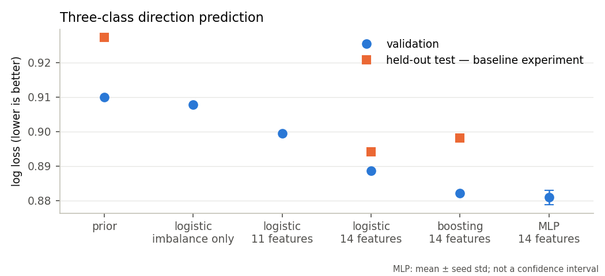
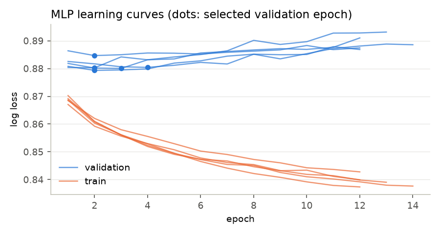
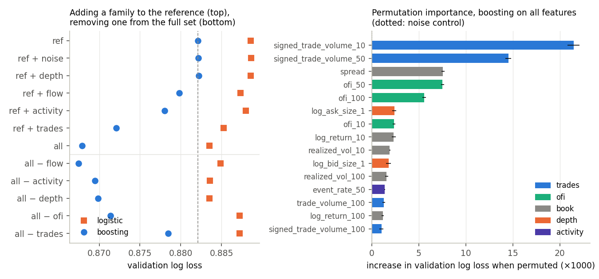
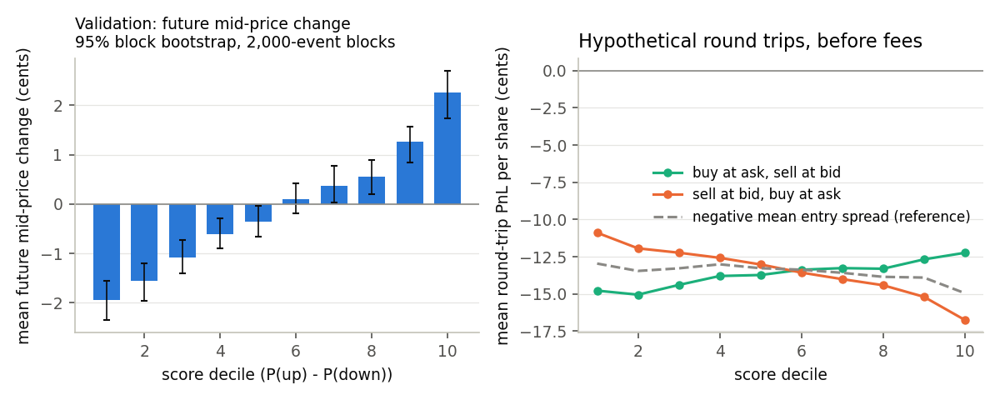
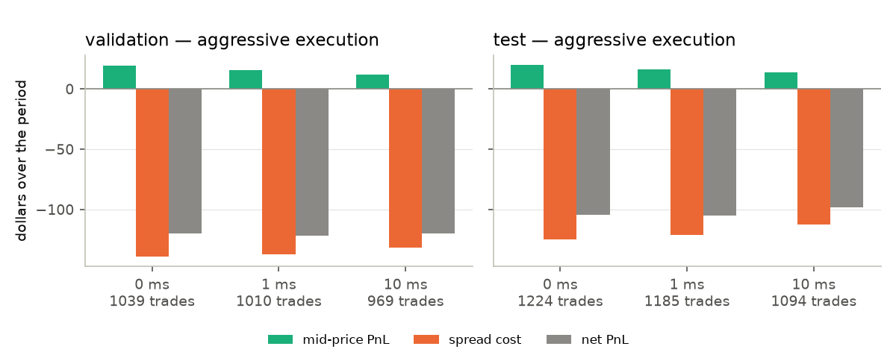
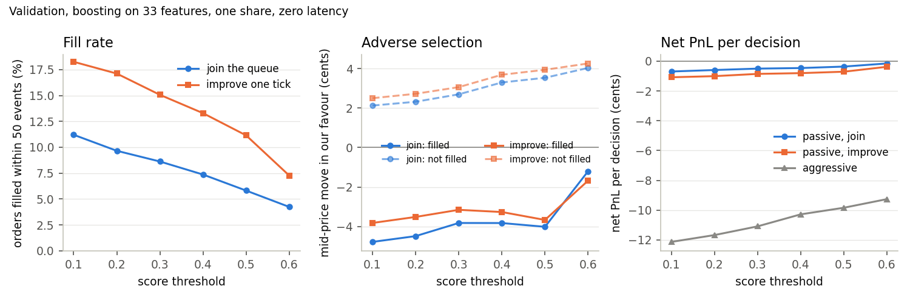

# Limit Order Book Prediction & Execution

Predict short-horizon mid-price direction from the order book, then measure
what that prediction is worth at executable bid and ask prices.

The data is one LOBSTER level-10 session: AAPL, 21 June 2012, 400,391 events.
The models beat a class-prior baseline on a chronologically held-out block.
The score is monotonically related to the realised mid-price move, with block
bootstrap intervals that exclude zero in the extreme deciles. Executed
aggressively, the same signal loses money: about 2 cents of favourable
mid-price movement per trade against 10 cents of spread cost, even with zero
fees and zero latency. Executed passively, with limit orders replayed
against the message stream, it loses less but is filled mostly when the
price is about to move against it. This is one stock on one day, so it says
nothing yet about other sessions or a deployable strategy.

## Research protocol

- Target: sign of the mid-price change 50 events ahead. Three classes, down,
  unchanged, up, with a zero threshold in the reference experiment. Labels
  compare integer quote-price sums, so there are no floating-point ties.
- Chronological 60 / 20 / 20 split into train, validation and test, with the
  last 50 label origins of each block removed so no label reaches the next block.
  Features are causal and may use history from earlier blocks, since that
  history is available at prediction time.
- Scalers and models are fitted on the training block only.
- The test block was evaluated once, with the model and strategy choices fixed
  on validation. Later experiments (MLP, bootstrap) use validation only; test
  numbers appear only where they were part of that single evaluation.

Usable observations: 240,084 train, 80,028 validation, 80,029 test. On
validation, 50 events last 2.6 seconds at the median, and between 0.03 and 15
seconds at the 1st and 99th percentiles.

## Features and models

The 14 inputs are the spread, quantity imbalance at levels 1, 5 and 10, the
quantity-weighted mid-price offset, log returns and realised volatility over
10, 50 and 100 events, and level-one order flow imbalance (Cont, Kukanov and
Stoikov) summed over the same windows. OFI counts quote-price and quantity
changes at the touch; it is not signed trade volume.

Models: class-prior baseline; standardised logistic regression on level-one
imbalance alone, on the 11 book and history features, and on all 14; histogram
gradient boosting on the 14; an MLP (32, 16) on standardised inputs trained one
epoch at a time, keeping the epoch with the lowest validation log loss, stopped
after 10 epochs without improvement, 100 at most, over seeds 0, 1, 2, 3 and 42.

## Results

Reference runs are saved in `reports/baseline_v1` and `reports/mlp_v1_multiseed`.
New runs go into their own folders and do not update this table.

| Model | Validation log loss | Test log loss | Validation accuracy |
|---|---:|---:|---:|
| Prior baseline | 0.910 | 0.927 | 48.1% |
| Logistic, imbalance only | 0.908 | | 51.1% |
| Logistic, 11 features | 0.900 | | 52.6% |
| Logistic, 14 features | 0.889 | 0.894 | 55.3% |
| Boosting, 14 features | 0.882 | 0.898 | 55.6% |
| MLP, 14 features, 5 seeds | 0.881 ± 0.002 | not evaluated | 55.9% |



Three observations. Adding the three OFI windows lowers the logistic log loss
by 0.011, more than the ten other features add to level-one imbalance; OFI is
the feature family that matters most here. Boosting and the MLP are within
seed noise of each other, and the MLP's best epoch is always 2 to 4, so on this
data a larger model is not the obvious next step. On the test block the
logistic model has lower log loss than boosting; overfitting to the training
regime is the natural explanation, but this single ordering does not prove it.



The unchanged class is rare (7.6% of validation, 8.6% of test) and no model
predicts it, so accuracy is essentially a down-versus-up number. Macro F1
makes that weakness visible.

### Feature families from the message file

The 14 reference features only look at the book. `features_v1` adds four
families built from the LOBSTER message stream and one control, evaluates
each family added to the reference and each removed from the full set, and
ranks every column by permutation importance on validation. All sets are
fitted on the same rows.

| Family | Columns |
|---|---|
| trades | signed and total executed volume over 10, 50, 100 events (visible and hidden executions; a trade that hits a sell order counts positive) |
| flow | net limit-order flow (signed submissions minus signed cancellations) and cancelled volume over the same windows |
| activity | log time since the previous event, event rate over 50 and 100 events |
| depth | log quantity at the touch and over five levels, each side |
| noise | one standard normal column, independent of the data |



| Boosting, validation | log loss |
|---|---:|
| reference (14) | 0.882 |
| reference + trades | 0.872 |
| reference + activity | 0.878 |
| reference + flow | 0.880 |
| reference + depth | 0.882 |
| reference + noise | 0.882 |
| all real families (33) | 0.868 |
| all − trades | 0.878 |
| all − ofi | 0.871 |
| all − depth | 0.870 |
| all − activity | 0.869 |
| all − flow | 0.867 |

Signed executed volume over the last 10 and 50 events is the strongest
column in the whole set: permuting it costs 0.021 and 0.015 of log loss,
against 0.008 for the spread and for OFI over 50 events. Adding the trades
family alone gains 0.010, ten times the gap between boosting and the MLP.
Depth adds nothing on its own but 0.002 once trades are present, a plausible
interaction between resting size at the touch and the volume hitting it.
Flow adds nothing, and the noise column has exactly zero importance, so the
boosting model never split on it. The level-1, 5 and 10 imbalances come out
at zero or slightly negative once OFI and signed volume are in, which says
they were carrying the same information less precisely.

These are validation numbers. The 33-feature model has not been evaluated on
the test block, and will not be until a fresh session is available.

## From scores to execution

The score is P(up) − P(down). Sorting validation events into score deciles
gives a monotone relation with the realised mid-price change, from −1.9 cents
in the lowest decile to +2.3 cents in the highest. The right panel shows what
happens when each event is traded aggressively, buying at the ask and selling
at the bid 50 events later: even the best decile loses about 12 cents per
share, because the average spread on this session is 13 cents.



The strategy backtest fixes the rules on validation: buy when the score exceeds
0.3, sell short below −0.3, otherwise abstain; one share, at most one pending
or open position; exit 50 events after the decision; aggressive fills at the
best quote at order arrival; symmetric entry and exit latency of 0, 1 or 10 ms
with shared period deadlines; no explicit fees. Each round trip is decomposed
as

`net PnL = side × q × (exit mid − entry mid) − q × (entry spread + exit spread) / 2 − fees`

and the decomposition is checked against the recorded execution PnL.

| Test block, boosting strategy | 0 ms | 1 ms | 10 ms |
|---|---:|---:|---:|
| Completed round trips | 1,224 | 1,185 | 1,094 |
| Mid-price PnL ($) | 20.2 | 16.2 | 13.9 |
| Spread cost ($) | 124.6 | 121.0 | 112.4 |
| Net PnL ($) | −104.4 | −104.8 | −98.5 |
| Mean net PnL per trade ($) | −0.085 | −0.088 | −0.090 |

At zero latency the favourable mid movement is 1.65 cents per trade against
10.2 cents of spread cost. Latency changes which trades occur, so the columns
compare whole strategies rather than the same orders delayed; the smaller loss
at 10 ms comes with fewer trades and a worse mean.



### Uncertainty

Neighbouring labels overlap and trades cluster in time, so plain standard
errors would be too small. `uncertainty_v1` refits the boosting model and
resamples with a moving block bootstrap: blocks of consecutive events for the
decile means (500, 2,000 and 5,000 events; the intervals barely change) and
blocks of 25 consecutive trades for the backtest, 1,000 resamples, 95%
percentile intervals.

| Quantity | Estimate | 95% interval |
|---|---:|---:|
| Validation, decile 10 mean move (cents) | +2.31 | [+1.79, +2.77] |
| Validation, decile 1 mean move (cents) | −1.92 | [−2.35, −1.53] |
| Validation, favourable move in the two extreme deciles (cents) | 2.11 | [1.82, 2.43] |
| Test, mid-price PnL, 1,224 trades ($) | 20.2 | [17.1, 23.4] |
| Test, spread cost ($) | 124.6 | [113.1, 136.8] |
| Test, net PnL ($) | −104.4 | [−114.9, −94.3] |

The signal is distinguishable from zero, and so is the loss. The two cannot be
closed by a threshold or a seed: on this day and at this horizon, the
directional edge is an order of magnitude smaller than the cost of crossing
the spread twice.

### Does the better model change the execution picture?

`signal_v1` repeats the decile and backtest analysis on validation for the
14-feature reference and the 33-feature model, both boosting.

| Validation, boosting | 14 features | 33 features |
|---|---:|---:|
| Favourable move in the two extreme deciles (cents, 95% interval) | 2.11 [1.82, 2.43] | 2.62 [2.29, 2.92] |
| Decile 10 / decile 1 mean move (cents) | +2.31 / −1.92 | +2.66 / −2.59 |
| Backtest, threshold 0.3: trades, mid-price PnL per trade | 1,039, 1.8 c | 1,229, 2.1 c |
| Backtest, threshold 0.6: trades, mid-price PnL per trade | 122, 2.7 c | 236, 3.8 c |
| Spread cost per trade (cents) | 13.4 | 13.2 |

The gain in log loss is a gain in cents too, about 25% more favourable
movement in the extreme deciles, and the full model is better at every
threshold. It is still nowhere near the spread: at the most selective
threshold, 3.8 cents of signal against 13 cents of cost. Improving the
prediction was worth doing and does not rescue aggressive execution at this
horizon, which is the reason the next step is passive execution rather than
a bigger model.

## Passive execution

`lob/passive.py` replays the message stream around each decision to ask what
a limit order would have done. The assumptions are listed at the top of the
file; the ones that matter are: zero latency; the order either joins the
back of the visible queue at the best quote or improves the quote by one
tick (an empty queue in front, possible because the spread averages 13
ticks); only visible executions on our side and at our price consume the
queue ahead, and cancellations are assumed to sit behind us; a trade on our
side at a worse price than ours would have hit us first; unfilled orders are
cancelled 50 events after the decision; a filled position is closed
aggressively at that same event. Each filled round trip decomposes as

`net PnL = mid-price move + (decision mid − limit price) − exit spread / 2 − fees`

so the entry earns about half a spread and the exit pays about half a spread.



| Validation, 33 features, threshold 0.3 | Join the queue | Improve one tick | Aggressive |
|---|---:|---:|---:|
| Decisions | 1,229 | 1,228 | 1,229 |
| Filled | 8.6% | 15.1% | 100% |
| Median time to fill (s) | 1.9 | 1.5 | 0 |
| Mid-price move when filled (cents) | −3.8 | −3.2 | |
| Mid-price move when not filled (cents) | +2.7 | +3.1 | |
| Entry edge per fill (cents) | +4.4 | +3.6 | −6.6 |
| Exit cost per fill (cents) | −6.3 | −6.1 | −6.6 |
| Net per fill (cents) | −5.8 | −5.7 | −11.1 |
| Net per decision (cents) | −0.5 | −0.9 | −11.1 |

This is adverse selection in its plainest form. The orders that get filled
are the ones where the mid-price then moves against the position by 3 to 4
cents; the orders that do not get filled are the ones where the signal was
right, and the price moved away by about 3 cents. The half spread earned at
entry is smaller than the half spread paid at exit, because fills happen
when the spread is narrow, and the adverse move takes the rest. Improving
the quote by a tick roughly doubles the fill rate and costs a tick of edge;
it does not change the sign. The picture is the same with the 14-feature
model and at every threshold (`reports/passive_v1`).

Passive entry therefore loses about ten times less per decision than
aggressive entry, but it still loses, and it captures almost none of the
signal: the 85% of decisions that go unfilled are precisely the ones the
model got right. With this signal and this horizon, the best of the three
actions studied so far, aggressive, passive or abstain, is abstain.

What that leaves open is the two-sided case: resting on both sides and
exiting passively as well, which is the market-maker's problem. There the
question is not whether the signal pays for crossing the spread but whether
it reduces the adverse selection a quoter suffers, by skewing or pulling
quotes when the model expects a move. That is the next experiment.

## Code layout

| File | Responsibility |
|---|---|
| `run_experiment.py` | Parse arguments and dispatch one named experiment |
| `lob/experiments.py` | `ExperimentConfig`, shared preparation, the experiments, manifests |
| `lob/data.py` | Read and align LOBSTER files, validate snapshots |
| `lob/features.py` | Causal feature calculations |
| `lob/labels.py` | Integer-comparison direction labels |
| `lob/splits.py` | Purged chronological splits and usable-row masks |
| `lob/models.py` | Model fitting, including epoch-wise MLP training |
| `lob/evaluation.py` | Classification diagnostics, score bins, PnL decomposition |
| `lob/execution.py`, `lob/backtest.py` | Aggressive execution and non-overlapping strategy simulation |
| `lob/passive.py` | Limit-order replay: queue position, fills, cancellation, PnL decomposition |
| `lob/message_features.py` | Trade, order-flow, activity and depth features from the message file |
| `lob/uncertainty.py` | Moving block bootstrap |
| `make_figures.py` | Figures from saved CSVs, no training required |

Input validation is deliberately strict: crossed books, non-monotonic
timestamps, sentinel prices, insufficient exit liquidity and future columns
used as features all raise rather than being silently handled. `pytest` runs
127 tests over features, labels, splits, execution, latency, the limit-order replay and the bootstrap.

## Setup and data

```bash
python -m venv .venv
source .venv/bin/activate
python -m pip install -r requirements-lock.txt   # reference versions (Python 3.12)
```

`requirements.txt` lists the unpinned dependencies; expect differences in the
third decimal of the boosting metrics across scikit-learn versions.

Download the AAPL 2012-06-21 level-10 sample from
[LOBSTER](https://lobsterdata.com/info/DataSamples.php) and place the two
files in `data/raw/`:

```text
AAPL_2012-06-21_34200000_57600000_message_10.csv
AAPL_2012-06-21_34200000_57600000_orderbook_10.csv
```

Raw data stays out of Git. The effective configuration is `ExperimentConfig`
in `lob/experiments.py`.

## Running experiments

```bash
python run_experiment.py baseline_v1      # models, diagnostics, backtests, the one test evaluation
python run_experiment.py mlp_multiseed    # MLP on validation, 5 seeds
python run_experiment.py uncertainty_v1   # block bootstrap intervals
python run_experiment.py features_v1      # message-file feature families, ablations, permutation importance
python run_experiment.py signal_v1        # signal in cents, reference versus full feature set (validation)
python run_experiment.py passive_v1       # limit-order replay versus aggressive execution (validation)
python make_figures.py                    # figures from the reference folders
python -m pytest -q
```

Each run creates a new directory under `reports/runs/` (or the path given with
`--output-dir`, which must not exist) containing `manifest.json` with the
configuration, input and source hashes, dependency versions and git revision,
`dataset_summary.json`, fitted estimator parameters, per-scenario trade and
order logs, a `status.json`, and the metric CSVs. The reference folders are
never overwritten. `make_figures.py` accepts `--baseline-dir`, `--mlp-dir`, `--uncertainty-dir`,
`--features-dir` and `--passive-dir` to render a different run, and writes `figure_sources.json`
with the hashes of the CSVs it used.

## Limitations and next steps

One stock, one day: the test block shares the session with training, so the
results say nothing about other dates, and other names from the same date
would test transfer across assets rather than across time. Execution is
simplified to full fills of one share at the best level, with no impact, no
partial fills and no short-borrow cost. The limit-order replay assumes
cancellations sit behind our order, ignores hidden liquidity at our price,
has no partial fills and no latency on placement or cancellation; it also
cannot know how other participants would have reacted to our order.

Planned, in order: two-sided passive quoting with the signal used to skew
or pull quotes; event versus clock-time horizons and decisions after estimated costs;
more sessions with a fresh reserved test block.
